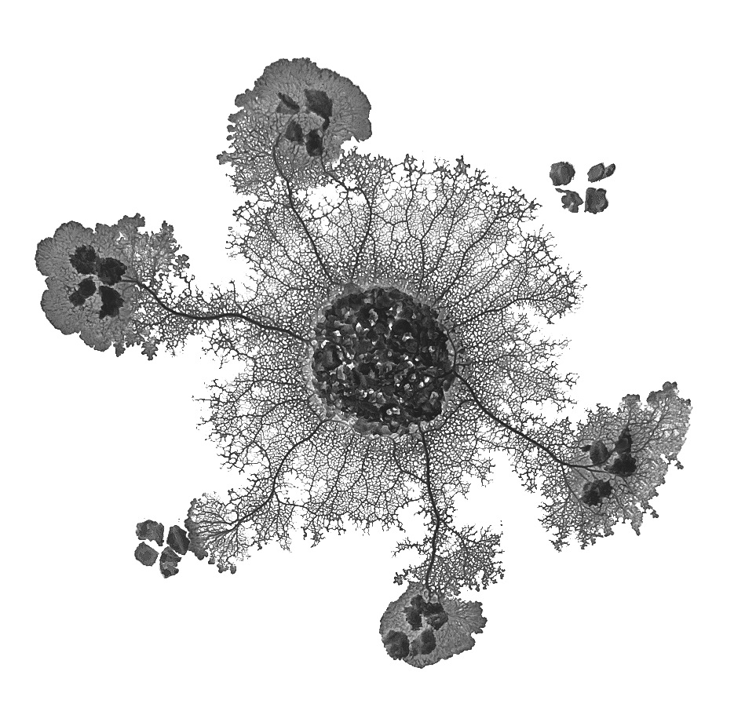

# Physarum



Complex Systems exam final project: *Physarum polycephalum slime mould computing simulations.*

By [Matteo Coppola](https://github.com/matteocoppola), [Luca Palazzi](https://github.com/lucapalazzi), [Antonio Vivace](https://github.com/avivace).

### [Live demo](https://avivace.github.io/Physarum)

### [Documentation](slides.pdf)


## Develop

Clone the project locally: `git clone git@github.com:avivace/Physarum.git`

### Unity

Be sure you are on Unity 2018.3.14f1 (64-bit).

> Use windows to produce the webgl build, since on linux it doesn't work, reporting `il2cpp/build/il2cpp.exe did not run properly!`.

**Unity** -> **Open Project** -> Select the **"UnityProject"** folder inside the cloned repository. Once the project import finished, drag and drop the "SampleScene" from the assets folder (Project Pane) into the Hyerarchy pane.

Each attached component and selected asset for a component loses its link due to cache being invalidated when exporting/importing so you have to manually select:

- SimulationManager script, attached to GameObject
    + ImageAsset, pointing to the desired map to run
    + Tile: tile(Tile)
    + Camera: the main Camera
- Click on Tile from the inspector, and select the sprite (DefaultSprite)
- Attach the CameraManager script to the Main Camera

Double click on "SampleScene" then you can run the project (Play).

### Web UI application

A simple VueJS application, using Vuetify as CSS framework. 
The Unity webgl build must be placed in `assets/`


```
npm run serve
```

Due to GitHub limitations for github pages, we use the `master` branch to deploy builds, and the `develop` as an actual branch.

#### Deploy

```
npm run deploy
```

Builds the web application and deploys it at [avivace.github.io/Physarum](https://avivace.github.io/Physarum).

An internal API has been developed to allow bidirectional stateful comunication between the VueJS instance and the webgl build of the Unity application. The Unity application is able to send updates about the status of the simulation to Vue, so we can se real time updates, while the Vue application can send actions and modify parameters or select the map.

Vue -> Unity's PayloadHandler

Unity ExternalCall -> Vue

### Documentation

To build:
```
cd docs/
pdflatex report.tex
```

## Resources

#### Web UI <-> Unity

- [WebGL: Interacting with browser scripting](https://docs.unity3d.com/2018.4/Documentation/Manual/webgl-interactingwithbrowserscripting.html)
- [JsonUtility.FromJson](https://docs.unity3d.com/ScriptReference/JsonUtility.FromJson.html)
- [Application.ExternalCall](https://docs.unity3d.com/540/Documentation/ScriptReference/Application.ExternalCall.html)
- [Application.ExternalEval](https://docs.unity3d.com/540/Documentation/ScriptReference/Application.ExternalEval.html)
